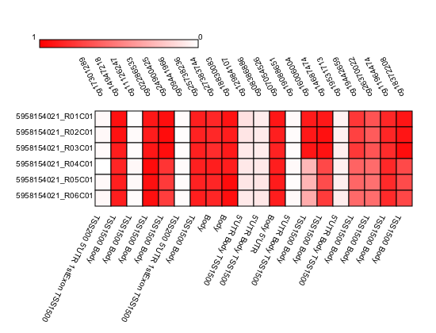
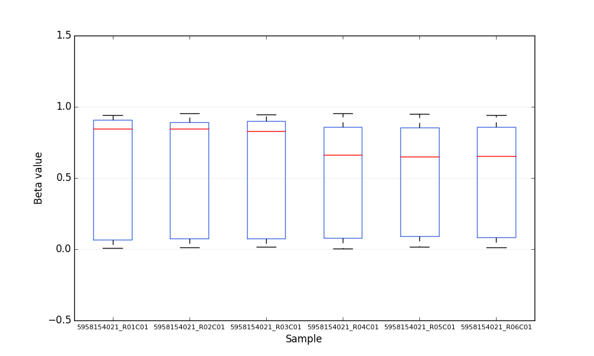

Introduction
============

Why pyMAP?
----------
This is a very interesting question that deserves to be answered properly.
All 450K platform analysis software developed so far are made using R scripts.
While we appreciate R as a powerful statistical platform, we also believe in diversity of different analysis platforms.
Python, which is a simple yet powerful language, can also be used for these analysis.
This language is increasingly being used by scientists to address computational aspect of their work.
pyMAP, implemented in native python, offers a more powerful alternative which utilizes python scripts that can be deployed easily and can also be modified to suit the study.

Documentation
-------------

Here, we have provided detailed documentations of Classes and Functions of PyMAP module.
Documentations are mostly based on a single dataset that are used throughout the examples for consistency in data structures.
The dataset is publicly available and can be downloaded from http://www.ncbi.nlm.nih.gov/geo/query/acc.cgi?acc=GSE42308 .

Examples
--------
Here goes an example of what pymap can do!

In the first example, we will create an annotation object that you can use to extract methylation values form samples.
This object will hold Illumina probe information.

..  code-block:: python
    :linenos:

    # Import Annotation submodule to parse and prepare probe information.
    import pymap.Annotation

    # Create Annotation object.
    # This object well parse through all probes annotation information Illumina has provided for probes used in 450K platform.
    annotation = pymap.Annotation.Annotator()

    # Get number of probes in the annotation object.
    probe_number = annotation.get_number()
    print(probe_number)

    # Remove known SNPs easily with a simple method.
    # This filteration step might be useful for most studies in human subjects.
    annotation.remove_snp_probes()

    # Get number of probes after SNP removal from the annotation object.
    probe_number = annotation.get_number()
    print(probe_number)

In the second example, we parse samples:

..  code-block:: python
    :linenos:

    # Import Core submodule to parse data.
    import pymap.Core

    # Parse a single data file.
    parsed_samples = Core.ParseFile("data.txt")

    # Parse multiple data file.
    parsed_samples = Core.ParseBatch("/Data")

    # Get Sample data from either one or multiple files. samples contains a list of samples.
    # Please see sample object documentations.
    samples = parsed_samples.get_samples()

In the third example, we integrate Core and Annotation objects to extract methylation data from p53 gene probes:

..  code-block:: python
    :linenos:

    # Get all probes associated with p53 gene:
    probe_list = annotations.get_probes_from_gene("TP53")

    # Export data associated with selected probes and samples into a data frame:
    pymap.Core.write_data("data.txt", samples, probe_list)

    # Export probe and methylation data into BED file format.
    # In this example we export data for the first sample (sample[0]).
    pymap.Core.probes_to_bed("Export/test2.bed", probe_list, samples[0])

    # Export all samples into separate BED file.
    pymap.Core.samples_to_bed("Export/me", probe_list, samples)

In the fourth example, we extract features from features.

..  code-block:: python
    :linenos:

    # Get probes from get_all_probe_id function of annotation object.
    probes = annotations.get_probes(annotations.get_all_probe_ids())

    # Get probes that are positioned in the island.
    probe_list = Annotation.get_probes_from_feature(probes,
    Annotation.Feature(Annotation.CpG_location.ISLAND))

    # Get probes that are within 200 bp of TSS.
    probe_list = Annotation.get_probes_from_feature(probes,
    Annotation.Feature(Annotation.Location.TSS200)

    # Get probes that are positioned close to BRCA1.
    probe_list = Annotation.get_probes_from_feature(probes, "BRCA1"))

In the following example we generate a heatmap of probes that are associated with BRCA1 gene.

..  code-block:: python
    :linenos:

    # Get probes that are positioned close to BRCA1.
    probe_list = Annotation.get_probes_from_feature(probes, "BRCA1"))

    # Sort probes based on genomic coordinate.
    probe_list = annotations.sort_coord_probe(probe_list)

    # Import plot package.
    import pymap.Plot

    # Generate heatmap
    Plot.Heatmap(samples, probe_list, "BRCA1_probes.png")

**Output heatmap image**

The following example will generate BoxPlot figure of probes that are associated with BRCA1.

..  code-block:: python
    :linenos:

    # import the plotting module.
    import pymap.Plot

    # Get probes that are positioned close to BRCA1.
    probe_list = Annotation.get_probes_from_feature(probes, "BRCA1"))

    # Plot the probe methylation values.
    Plot.BoxPlot(probe_list, samples)

**Output BoxPlot image**

Citation and Contact
--------------------
Please cite this package with the Github URL until it is published.
Please contact authors using Gitub platform for any inquiry.
